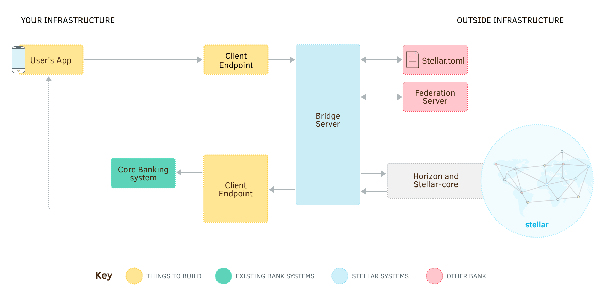

When testing the bridge server, we added a `memo` to the transaction in order to identify what customer account to credit. However, other people and organizations using Stellar might not know they need to do that. How do they find out?

The [Stellar federation protocol](../concepts/federation.md) allows you to convert a human-readable address like `amy*your_org.com`[^friendly_names] to an account ID. It also includes information about what should be in a transaction’s `memo`. When sending a payment, you contact a federation server first to determine what Stellar account ID to pay. Luckily, the bridge server does this for you.



Stellar.org provides a [prebuilt federation server](https://github.com/stellar/go/tree/master/services/federation) that can hook into an existing user database, but you can also write your own.


## Create a Database

The Stellar federation server is designed to connect to any existing SQL database you might have with a list of account names. It essentially translates a federation request into a SQL query. The server supports MySQL, PostgreSQL, and SQLite3.

At a minimum, your database should have a table with a column identifying the name to use for each account record.[^federation_tables] In your existing system, you might have a table named `accounts` that looks something like:

| id | first_name | last_name | friendly_id         |
|----|------------|-----------|---------------------|
| 1  | Tunde      | Adebayo   | tunde_adebayo       |
| 2  | Amy        | Smith     | amy_smith           |
| 3  | Jack       | Brown     | jack_brown          |
| 4  | Steintór   | Jákupsson | steintor_jakupsson  |
| 5  | Sneha      | Kapoor    | sneha_kapoor        |

Where Tunde’s Stellar address would be `tunde_adebayo*your_org.com`.


## Download and Configure Federation Server

Next, [download the latest federation server](https://github.com/stellar/go/releases) for your platform. Install the executable anywhere you like. In the same directory, create a file named `federation.cfg`. This will store the configuration for the server. It should look something like:

<code-example name="federation.cfg">

```toml
port = 8002

[database]
type = "mysql" # Or "postgres" or "sqlite3"
url = "dbuser:dbpassword@/internal_accounts"

[queries]
federation = "SELECT 'GAIGZHHWK3REZQPLQX5DNUN4A32CSEONTU6CMDBO7GDWLPSXZDSYA4BU' as id, friendly_id as memo, 'text' as memo_type FROM accounts WHERE friendly_id = ? AND ? = 'your_org.com'"
reverse-federation = "SELECT friendly_id, '' as domain FROM accounts WHERE ? = ''"

# The federation server must be available via HTTPS. Specify your SSL
# certificate and key here. If the server is behind a proxy or load  balancer
# that implements HTTPS, you can omit this section.
[tls]
certificate-file = "server.crt"
private-key-file = "server.key"
```

</code-example>

Make sure to update the database connection information with the proper credentials and name for your database. Also update the value of `domain` in the `federation` query to match your actual domain instead of `your_org.com`.

The `federation` query is a SQL query that should return the columns `id`, `memo`, and `memo_type` when supplied with the two parts of a Stellar address, e.g. `tunde_adeboyo` and `your_org.com` for the address `tunde_adebayo*your_org.com`.

Since we are mapping all addresses to our base account, we always return the base account ID for `id`. As in the first section, we want the account’s `friendly_id` as a text memo.

The `reverse-federation` query is required, but because all customer accounts map to a single Stellar account in our design, we need to make sure this query always returns no rows.

Now run the server! (Unlike the bridge server, there’s there no custom database to migrate.)

```bash
./federation
```


## Update Stellar.toml

Finally, others have to know the URL of your federation server. The [`stellar.toml` file](../concepts/stellar-toml.md) is publicly available file where others can find information about your Stellar integration. It should always be stored at:

`https://www.[YOUR DOMAIN]/.well-known/stellar.toml`

It can list all sorts of properties, but the one we care about now is the URL for your federation server. Your `stellar.toml` file should look something like:

<code-example name="stellar.toml">

```toml
FEDERATION_SERVER = "https://www.your_org.com:8002/federation"
```

</code-example>

The actual URL for your federation server can be anything you like—it can be at your `www` subdomain but on a different path, it can be at a different port, or it can be on a different domain entirely. **However, it must be available via HTTPS with a valid SSL certificate.**[^ssl]


## Send a Federation request

Test out your federation server by sending an HTTP request:

<code-example name="Request a Federation Info">

```bash
curl "https://www.your_org.com:8002/federation?q=tunde_adebayo*your_org.com&type=name"
```

```js
var request = require('request');

request.get({
  url: 'https://www.your_org.com:8002/federation',
  qs: {
    q: 'tunde_adebayo*your_org.com',
    type: 'name'
  }
}, function(error, response, body) {
  console.log(body);
});
```

```java
import org.apache.http.HttpEntity;
import org.apache.http.HttpResponse;
import org.apache.http.client.HttpClient;
import org.apache.http.client.methods.HttpGet;
import org.apache.http.impl.client.HttpClients;
import org.apache.http.util.EntityUtils;
import org.apache.http.client.utils.URIBuilder;
import java.net.URI;

class FederationRequest {
  public static void main(String [] args) throws Exception {
    URI federationUri = new URIBuilder("https://www.your_org.com:8002/federation")
      .addParameter("q", "tunde_adebayo*your_org.com")
      .addParameter("type", "name")
      .build();

    HttpGet federationRequest = new HttpGet(federationUri);
    HttpClient httpClient = HttpClients.createDefault();
    HttpResponse response = httpClient.execute(federationRequest);
    HttpEntity entity = response.getEntity();
    if (entity != null) {
      String body =  EntityUtils.toString(entity);
      System.out.println(body);
    }
  }
}
```

</code-example>

You should get a response like:

```json
{
  "stellar_address": "tunde_adebayo*your_org.com",
  "account_id": "GAIGZHHWK3REZQPLQX5DNUN4A32CSEONTU6CMDBO7GDWLPSXZDSYA4BU",
  "memo_type": "text",
  "memo": "tunde_adebayo"
}
```

<nav class="sequence-navigation">
  <a rel="prev" href="2-bridge-server.md">Back: Bridge Server</a>
  <a rel="next" href="4-compliance-server.md">Next: Compliance Server</a>
</nav>


[^friendly_names]: Federated addresses use an `*` to separate the username and domain so that your usernames can be e-mail addresses, like `amy@gmail.com*your_org.com`.

[^federation_tables]: If you want your federation server to cover multiple domains, you’ll need a column to store the domains as well.

[^ssl]: Requiring that public services are available via SSL helps keep things secure. While testing, you can get free certificates from http://letsencrypt.org. You can also generate your own self-signed certificates, but you must add them to all the computers in your tests.
